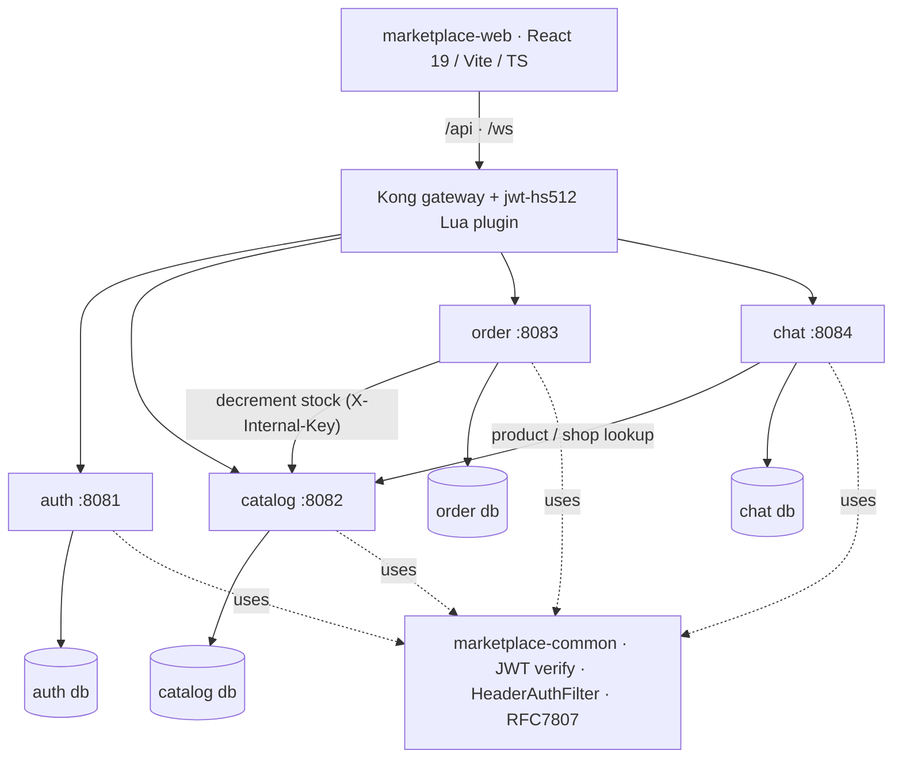

# Marketplace

Omnichannel multi-seller marketplace — a **greenfield microservices** build in Java/Spring + React, behind a Kong gateway. Six backend services, a shared library, a custom Kong plugin, and a React storefront — wired into one stack you can bring up with a single command.

> This repo is the **project hub**: architecture, the full [spec](./SPEC.md), the backlog (Issues + Project board), and links to every service repo.

## 📚 Documentation

### 🌐 **Live site: [taskeendev.github.io/marketplace](https://taskeendev.github.io/marketplace/)**

A static docs site (plain HTML/CSS) split by audience:

| For | Page |
|---|---|
| 🛒 Buyers | [Buyer guide](https://taskeendev.github.io/marketplace/buyer.html) |
| 🏪 Sellers | [Seller guide](https://taskeendev.github.io/marketplace/seller.html) |
| ⚙️ Developers | [API reference](https://taskeendev.github.io/marketplace/developer.html) — REST + WebSocket, auth, 47 endpoints, error codes, changelog |
| 🚀 Operators | [Run & operate](https://taskeendev.github.io/marketplace/operations.html) — architecture, one-command run, smoke test |

## Architecture



Every request enters through **Kong**. A custom Lua plugin verifies the HS512 JWT and injects `X-Auth-User` / `X-Auth-Role` headers that services trust — so no service parses tokens itself, and public endpoints still work when no token is present. Database-per-service; services call each other over the internal docker network.

## Highlights
- **No oversell, proven.** Inventory decrement is an atomic guarded `UPDATE` + ledger. The smoke test fires two checkouts at `stock=1` **in parallel** and asserts exactly one `201` and one `409`.
- **Real-time chat through the gateway.** Raw WebSocket `/ws/chat` with first-frame JWT auth (browsers can't set headers on a WS handshake); Kong proxies the upgrade. The smoke test connects **two WS clients through Kong** and verifies buyer→seller delivery.
- **Custom Kong plugin.** `jwt-hs512` (Lua) verifies the token and injects identity headers, passing through cleanly when absent.
- **Shared contract, not shared code.** `marketplace-common` carries JWT verification, the header-auth filter, and RFC7807 errors; the JWT is the inter-service contract.
- **Tested end-to-end.** Each service has integration tests (Testcontainers Postgres + MockWebServer for cross-service stubs); a 10-step `smoke.sh` exercises the whole stack through Kong.

## Repos
| Repo | Purpose |
|---|---|
| [marketplace-gateway](https://github.com/taskeendev/marketplace-gateway) | Kong gateway + `jwt-hs512` Lua plugin |
| [marketplace-auth](https://github.com/taskeendev/marketplace-auth) | register / login / JWT + refresh rotation / roles |
| [marketplace-catalog](https://github.com/taskeendev/marketplace-catalog) | categories / shops / products / **atomic inventory** |
| [marketplace-order](https://github.com/taskeendev/marketplace-order) | cart / checkout / orders / status lifecycle |
| [marketplace-chat](https://github.com/taskeendev/marketplace-chat) | real-time buyer↔seller chat (REST + WebSocket) |
| [marketplace-web](https://github.com/taskeendev/marketplace-web) | React 19 / Vite / TS / Tailwind / shadcn |
| [marketplace-deploy](https://github.com/taskeendev/marketplace-deploy) | docker-compose stack + run.sh + smoke.sh |
| [marketplace-common](https://github.com/taskeendev/marketplace-common) | shared lib (JWT verify, header auth, RFC7807) |

## Stack
Java 21 · Spring Boot 3.4 · Maven · **Kong** (DB-less) · PostgreSQL-per-service + Flyway · React 19 / Vite / TS / Tailwind / shadcn · Testcontainers.

## Run locally
```bash
# clone the marketplace-* repos into the same parent folder, then:
cd marketplace-deploy && cp .env.example .env
./run.sh --build -d     # builds jars, renders Kong config, brings up the stack
./smoke.sh              # 10 checks through Kong (incl. oversell + 2-client WS)
# web (dev): cd marketplace-web && npm run dev   ->  http://localhost:5173
```

## Demo
<!-- TODO(taskeen): capture from `npm run dev` and drop images into docs/img/ -->
| Storefront | Seller dashboard | Real-time chat |
|---|---|---|
| _screenshot_ | _screenshot_ | _GIF: two windows chatting live_ |

<details><summary>smoke.sh — end-to-end proof through Kong</summary>

```
1) health ✅
4) checkout 201 -> stock 0 ✅
6) oversell protected: exactly one 201, one 409 (no oversell) ✅
9) chat: REST 401(no-token), WS upgrade 101, conversation created via Kong ✅
10) chat: buyer sent -> seller received realtime through Kong ✅
ALL SMOKE PASSED ✅
```
</details>

## Phases
- **P0 — Foundation** ✅ Kong + auth + web shell + common
- **P1 — Core marketplace** ✅ catalog + inventory, cart/checkout, storefront + seller dashboard
- **P2 — Real-time chat** ✅ WebSocket chat through Kong, unread badges, product context
- P3 — social (FB/IG) · P4 — Hermes AI agent (answers in chat) · P5 — payments / reviews

Full spec + per-task API contracts: **[SPEC.md](./SPEC.md)** · Backlog: **Issues** + **Project board**.
Engineering notes / tech-debt: [#35](https://github.com/taskeendev/marketplace/issues/35) (P2) · [#38](https://github.com/taskeendev/marketplace/issues/38) (P0/P1).
